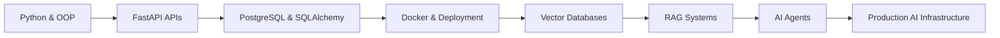

# 👋 Hi, I'm Omkar Shrotri

### AI/Backend Engineer in Training | Building Local AI Agents, RAG Systems & Production APIs

[](https://python.org)
[](https://fastapi.tiangolo.com)
[](https://postgresql.org)
[](https://docker.com)
[](https://github.com/omi1811)

> 🎯 Goal: Become an AI Engineer focused on production-grade RAG systems, local AI agents, backend infrastructure, and developer tooling.
>
> 🛠️ Stack: Python • FastAPI • PostgreSQL • Docker • ChromaDB • LangChain • Ollama • SQLAlchemy
>
> 📚 Currently Learning: AI agents, retrieval systems, scalable backend architecture, and local LLM tooling.

---

# 🚀 Featured Projects

| Project                                                                                           | Description                                                                                          | Tech Stack                      |
| ------------------------------------------------------------------------------------------------- | ---------------------------------------------------------------------------------------------------- | ------------------------------- |
| [local-dev-agent](https://github.com/omi1811/local-dev-agent)                                     | Fully local AI coding assistant with RAG + maker-checker architecture optimized for low VRAM systems | Python, Ollama, ChromaDB, RAG   |
| [ai-document-intelligence-platform](https://github.com/omi1811/ai-document-intelligence-platform) | AI-powered document processing and retrieval platform                                                | Python, FastAPI, Vector Search  |
| [doc-meta-pipeline](https://github.com/omi1811/doc-meta-pipeline)                                 | Production-style metadata extraction pipeline for PDFs, JSON, and text documents                     | Python, OOP, pytest             |
| [ehtms_tasks_application](https://github.com/omi1811/ehtms_tasks_application)                     | Production-ready task management backend with JWT auth and PostgreSQL                                | FastAPI, PostgreSQL, Docker     |
| [blog-backend-api](https://github.com/omi1811/blog-backend-api)                                   | Relational REST API with migrations and authentication                                               | FastAPI, SQLAlchemy, Alembic    |
| [PAC-MAN-using-RL](https://github.com/omi1811/PAC-MAN-using-RL)                                   | Deep Q-Learning implementation for Ms. Pac-Man                                                       | PyTorch, Reinforcement Learning |
| [Solar_Digital_twin](https://github.com/omi1811/Solar_Digital_twin)                               | Solar PV fault detection and digital twin simulation system                                          | Python, ETL, MATLAB/Simulink    |
| [digiQC-report](https://github.com/omi1811/digiQC-report)                                         | Flask-based quality reporting dashboard with Excel automation                                        | Flask, Pandas, Reporting        |

---

# 🧠 Current Focus

## AI Engineering

* Building local AI coding agents
* Retrieval-Augmented Generation (RAG)
* Vector databases & semantic search
* AI developer tooling
* LLM orchestration workflows

## Backend Engineering

* FastAPI production APIs
* PostgreSQL database design
* JWT authentication systems
* Dockerized deployments
* Scalable project architecture

## ML & Research

* Reinforcement learning systems
* Digital twin simulations
* AI-powered automation workflows
* Fault detection systems

---

# 📈 Learning Journey



---

# 🛠️ Tech Stack

## Languages

* Python
* SQL
* Bash

## Backend

* FastAPI
* Flask
* SQLAlchemy
* Pydantic
* Alembic

## Databases

* PostgreSQL
* ChromaDB
* Vector Databases

## AI/ML

* PyTorch
* LangChain
* Ollama
* Sentence Transformers
* Reinforcement Learning

## DevOps & Tools

* Docker
* Git & GitHub
* Linux
* Streamlit

---

# 📂 Repository Highlights

## 🔹 Local AI Coding Agent

A fully local AI coding assistant that:

* Reads entire repositories using RAG
* Generates context-aware production code
* Uses a maker-checker self-review loop
* Runs locally with no API costs
* Optimized for low VRAM systems

### Architecture

```text
User Request
     ↓
Repository RAG Engine
     ↓
Maker Model (Code Generation)
     ↓
Checker Model (Review & Feedback)
     ↓
Refinement Loop
     ↓
Safe File Writer
```

---

## 🔹 EHTMS Tasks Application

Production-style backend engineering project featuring:

* JWT Authentication
* PostgreSQL integration
* Dockerized environment
* Modular FastAPI architecture
* RESTful API design
* Secure environment configuration

---

## 🔹 PAC-MAN using Reinforcement Learning

Deep Q-Network implementation demonstrating:

* Convolutional neural networks
* Reinforcement learning fundamentals
* Agent training loops
* Experiment reproducibility
* Modular ML project structure

---

# 📊 GitHub Stats


---

# 🌱 Currently Building

* AI Document Intelligence Platform
* Local AI Coding Agent
* Semantic Search Systems
* Production-grade RAG pipelines
* Backend APIs with scalable architecture

---

# 🤝 Open To

* AI Engineering internships
* Backend Engineering roles
* Open-source collaboration
* Startup opportunities
* Remote AI/ML roles

---

# 📫 Connect With Me

* GitHub: [https://github.com/omi1811](https://github.com/omi1811)

---

# ⚡ Philosophy

> Build in public. Learn deeply. Ship practical systems.
>
> Focus on production-ready engineering, not tutorial-only projects.

---

⭐ If you find my projects interesting, feel free to star the repositories and connect with me.

